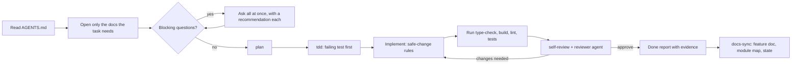
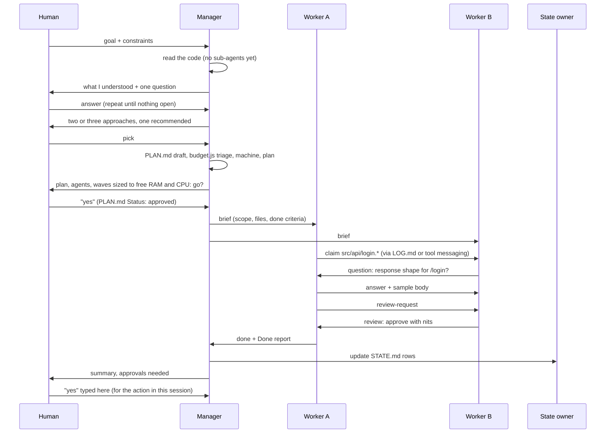
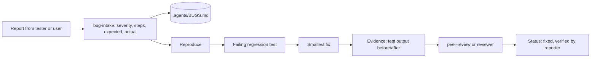
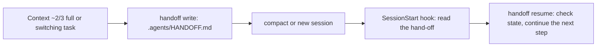
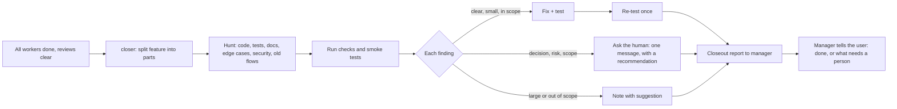
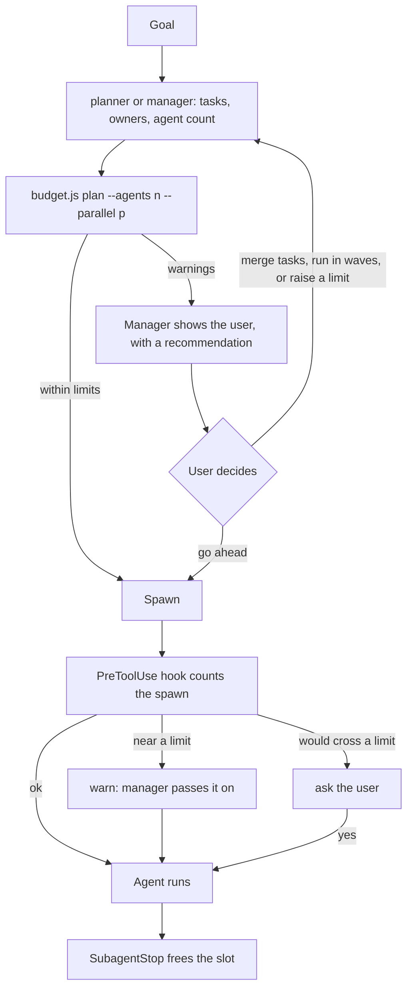
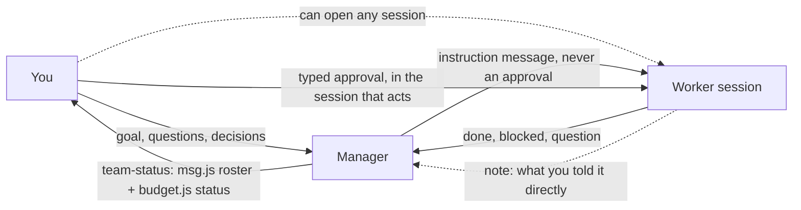

# Flow

## One task, one agent

```mermaid
flowchart LR
    A[Read AGENTS.md] --> B[Open only the docs the task needs]
    B --> C{Blocking questions?}
    C -->|yes| Q[Ask all at once, with a recommendation each] --> C
    C -->|no| P[plan]
    P --> T[tdd: failing test first]
    T --> I[Implement: safe-change rules]
    I --> V[Run type-check, build, lint, tests]
    V --> R[self-review + reviewer agent]
    R -->|changes needed| I
    R -->|approve| D[Done report with evidence]
    D --> S[docs-sync: feature doc, module map, state]
```

## Several agents

```mermaid
sequenceDiagram
    participant H as Human
    participant M as Manager
    participant A as Worker A
    participant B as Worker B
    participant S as State owner
    H->>M: goal + constraints
    M->>M: read the code (no sub-agents yet)
    M->>H: what I understood + one question
    H->>M: answer (repeat until nothing open)
    M->>H: two or three approaches, one recommended
    H->>M: pick
    M->>M: PLAN.md draft, budget.js triage, machine, plan
    M->>H: plan, agents, waves sized to free RAM and CPU: go?
    H->>M: "yes" (PLAN.md Status: approved)
    M->>A: brief (scope, files, done criteria)
    M->>B: brief
    A->>B: claim src/api/login.* (via LOG.md or tool messaging)
    B->>A: question: response shape for /login?
    A->>B: answer + sample body
    A->>B: review-request
    B->>A: review: approve with nits
    A->>M: done + Done report
    M->>S: update STATE.md rows
    M->>H: summary, approvals needed
    H->>M: "yes" typed here (for the action in this session)
```

## Bug

```mermaid
flowchart LR
    R[Report from tester or user] --> I[bug-intake: severity, steps, expected, actual]
    I --> BUGS[(.agents/BUGS.md)]
    I --> Rep[Reproduce]
    Rep --> F[Failing regression test]
    F --> Fix[Smallest fix]
    Fix --> Ev[Evidence: test output before/after]
    Ev --> Rev[peer-review or reviewer]
    Rev --> Close[Status: fixed, verified by reporter]
```

## Context reset

```mermaid
flowchart LR
    Full[Context ~2/3 full or switching task] --> W[handoff write: .agents/HANDOFF.md]
    W --> C[compact or new session]
    C --> SS[SessionStart hook: read the hand-off]
    SS --> Res[handoff resume: check state, continue the next step]
```

## Closeout

```mermaid
flowchart LR
    D[All workers done, reviews clear] --> C[closer: split feature into parts]
    C --> H[Hunt: code, tests, docs, edge cases, security, old flows]
    H --> R[Run checks and smoke tests]
    R --> S{Each finding}
    S -->|clear, small, in scope| F[Fix + test] --> R2[Re-test once]
    S -->|decision, risk, scope| A[Ask the human: one message, with a recommendation]
    S -->|large or out of scope| N[Note with suggestion]
    R2 --> REP[Closeout report to manager]
    A --> REP
    N --> REP
    REP --> U[Manager tells the user: done, or what needs a person]
```

## Spawn budget

```mermaid
flowchart TD
    G[Goal] --> PL[planner or manager: tasks, owners, agent count]
    PL --> BP[budget.js plan --agents n --parallel p]
    BP -->|warnings| U[Manager shows the user, with a recommendation]
    U --> D{User decides}
    D -->|merge tasks, run in waves, or raise a limit| PL
    BP -->|within limits| S[Spawn]
    D -->|go ahead| S
    S --> HK[PreToolUse hook counts the spawn]
    HK -->|near a limit| W[warn: manager passes it on]
    HK -->|would cross a limit| Q[ask the user]
    HK -->|ok| RUN[Agent runs]
    W --> RUN
    Q -->|yes| RUN
    RUN --> ST[SubagentStop frees the slot]
```

## You and the team

```mermaid
flowchart LR
    U[You] -->|goal, questions, decisions| M[Manager]
    U -.->|can open any session| W[Worker session]
    M -->|instruction message, never an approval| W
    W -->|done, blocked, question| M
    W -.->|note: what you told it directly| M
    M -->|team-status: msg.js roster + budget.js status| U
    U -->|typed approval, in the session that acts| W
```
