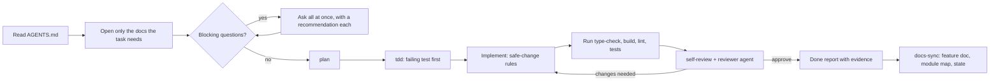
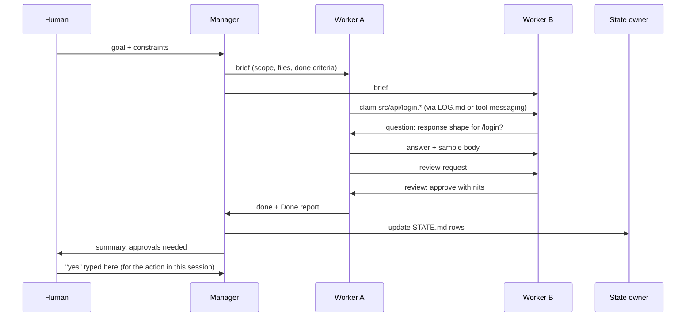
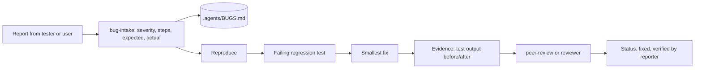
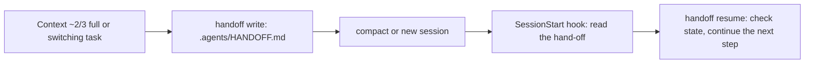

# Flow

## One task, one agent

```mermaid
flowchart LR
    A[Read AGENTS.md] --> B[Open only the docs the task needs]
    B --> C{Blocking questions?}
    C -->|yes| Q[Ask all at once, with a recommendation each] --> C
    C -->|no| P[plan]
    P --> T[tdd: failing test first]
    T --> I[Implement: safe-change rules]
    I --> V[Run type-check, build, lint, tests]
    V --> R[self-review + reviewer agent]
    R -->|changes needed| I
    R -->|approve| D[Done report with evidence]
    D --> S[docs-sync: feature doc, module map, state]
```

## Several agents

```mermaid
sequenceDiagram
    participant H as Human
    participant M as Manager
    participant A as Worker A
    participant B as Worker B
    participant S as State owner
    H->>M: goal + constraints
    M->>A: brief (scope, files, done criteria)
    M->>B: brief
    A->>B: claim src/api/login.* (via LOG.md or tool messaging)
    B->>A: question: response shape for /login?
    A->>B: answer + sample body
    A->>B: review-request
    B->>A: review: approve with nits
    A->>M: done + Done report
    M->>S: update STATE.md rows
    M->>H: summary, approvals needed
    H->>M: "yes" typed here (for the action in this session)
```

## Bug

```mermaid
flowchart LR
    R[Report from tester or user] --> I[bug-intake: severity, steps, expected, actual]
    I --> BUGS[(.agents/BUGS.md)]
    I --> Rep[Reproduce]
    Rep --> F[Failing regression test]
    F --> Fix[Smallest fix]
    Fix --> Ev[Evidence: test output before/after]
    Ev --> Rev[peer-review or reviewer]
    Rev --> Close[Status: fixed, verified by reporter]
```

## Context reset

```mermaid
flowchart LR
    Full[Context ~2/3 full or switching task] --> W[handoff write: .agents/HANDOFF.md]
    W --> C[compact or new session]
    C --> SS[SessionStart hook: read the hand-off]
    SS --> Res[handoff resume: check state, continue the next step]
```
